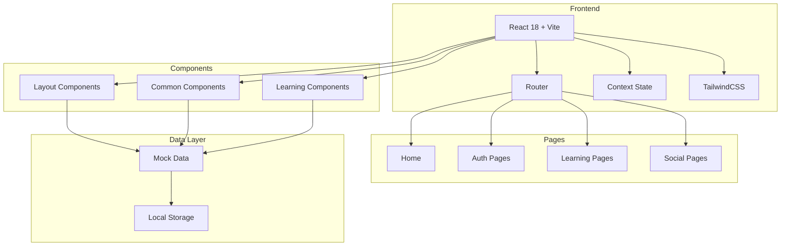

# 多语种在线教育平台 - 技术架构文档

## 1. 架构设计



## 2. 技术选型说明

### 2.1 前端技术栈
| 技术 | 版本 | 用途 |
|------|------|------|
| React | 18.x | UI框架,组件化开发 |
| Vite | 5.x | 构建工具,快速热更新 |
| TailwindCSS | 3.x | 原子化CSS,快速样式开发 |
| React Router | 6.x | 单页应用路由管理 |
| Lucide React | 最新版 | 图标库 |

### 2.2 项目初始化
使用Vite创建React项目:
```bash
npm create vite@latest linguaflow -- --template react
cd linguaflow
npm install
npm install -D tailwindcss postcss autoprefixer
npx tailwindcss init -p
npm install react-router-dom lucide-react
```

### 2.3 数据存储
- **用户数据**: LocalStorage持久化
- **学习进度**: LocalStorage + Context状态管理
- **Mock API**: 模拟数据响应,无真实后端

## 3. 路由定义

| 路径 | 组件 | 说明 |
|------|------|------|
| `/` | Home | 首页 |
| `/login` | Login | 登录页 |
| `/register` | Register | 注册页 |
| `/dashboard` | Dashboard | 学习中心 |
| `/learn/:language/:level` | Learning | 学习模块选择 |
| `/vocabulary/:courseId` | Vocabulary | 单词学习 |
| `/grammar/:courseId` | Grammar | 语法练习 |
| `/speaking/:courseId` | Speaking | 口语跟读 |
| `/listening/:courseId` | Listening | 听力训练 |
| `/achievements` | Achievements | 成就中心 |
| `/community` | Community | 社区页 |
| `/profile` | Profile | 个人资料 |

## 4. 数据模型定义

### 4.1 用户模型 (User)
```typescript
interface User {
  id: string;
  email: string;
  username: string;
  avatar: string;
  nativeLanguage: string;
  learningLanguages: ('en' | 'jp' | 'kr')[];
  currentLevel: {
    [language: string]: string;
  };
  stats: {
    totalXP: number;
    streakDays: number;
    totalMinutes: number;
    wordsLearned: number;
  };
  achievements: string[];
  joinDate: string;
}
```

### 4.2 课程模型 (Course)
```typescript
interface Course {
  id: string;
  language: 'en' | 'jp' | 'kr';
  level: 'A1' | 'A2' | 'B1' | 'B2' | 'C1' | 'C2';
  title: string;
  description: string;
  units: Unit[];
  requiredXP: number;
  thumbnail: string;
}

interface Unit {
  id: string;
  title: string;
  lessons: number;
  vocabulary: number;
  grammar: number;
  speaking: number;
  listening: number;
}
```

### 4.3 单词数据 (Vocabulary)
```typescript
interface VocabWord {
  id: string;
  word: string;
  translation: string;
  pronunciation: string;
  example: string;
  exampleTranslation: string;
  audioUrl?: string;
  mastery: 'new' | 'learning' | 'reviewing' | 'mastered';
}
```

### 4.4 成就模型 (Achievement)
```typescript
interface Achievement {
  id: string;
  title: string;
  description: string;
  icon: string;
  category: 'streak' | 'skill' | 'social' | 'milestone';
  requirement: {
    type: string;
    value: number;
  };
  rewardXP: number;
}
```

## 5. 上下文状态管理

### 5.1 AuthContext
管理用户认证状态:
```typescript
{
  user: User | null,
  isAuthenticated: boolean,
  login: (email, password) => Promise<void>,
  register: (userData) => Promise<void>,
  logout: () => void,
  updateUser: (updates) => void
}
```

### 5.2 LearningContext
管理学习进度状态:
```typescript
{
  currentCourse: Course | null,
  progress: {
    [courseId]: Progress
  },
  startLesson: (courseId, lessonId) => void,
  completeLesson: (courseId, lessonId, score) => void,
  updateProgress: (updates) => void
}
```

## 6. Mock数据结构

### 6.1 课程数据 (courses.js)
- 3种语言: 英语、日语、韩语
- 每种语言6个级别: A1-C2
- 每级别3-5个单元
- 总计约100+学习单元

### 6.2 词汇数据 (vocabulary.js)
- 每单元20-30个核心词汇
- 包含发音、例句、翻译
- 支持记忆状态追踪

### 6.3 成就数据 (achievements.js)
- 连续学习成就(7天、30天、100天)
- 技能徽章(词汇、语法、口语、听力)
- 社交成就(发帖、点赞、分享)
- 里程碑成就(首次、完成课程)

## 7. 核心组件设计

### 7.1 布局组件
| 组件 | 用途 |
|------|------|
| Navbar | 顶部导航栏,Logo、菜单、用户头像 |
| Sidebar | 侧边导航,学习模块快速入口 |
| Footer | 页脚,版权信息 |

### 7.2 通用组件
| 组件 | 用途 |
|------|------|
| Button | 按钮组件,支持多种变体 |
| Card | 卡片组件,课程/成就展示 |
| ProgressBar | 进度条,学习进度可视化 |
| Modal | 模态框,确认/提示 |
| Avatar | 用户头像组件 |
| Badge | 徽章/标签组件 |

### 7.3 学习组件
| 组件 | 用途 |
|------|------|
| FlashCard | 翻转卡片,单词学习核心组件 |
| AudioRecorder | 录音组件,口语练习 |
| QuizQuestion | 题目组件,支持选择/填空 |
| AudioPlayer | 音频播放器,听力练习 |
| SpeakingIndicator | 口语评分可视化 |

## 8. 页面详细规格

### 8.1 首页 (Home)
- Hero区域: 全宽背景、学习语言选择卡片
- 语言卡片: 3种语言,图标+名称+简介
- 特色展示: 4个学习模块功能介绍
- CTA按钮: "开始学习"跳转注册/学习中心

### 8.2 学习中心 (Dashboard)
- 侧边栏: 收起/展开,导航菜单
- 统计卡片: 今日学习、本周时长、连续天数
- 课程列表: 语言分类、级别、进度条
- 快速入口: 继续学习、错题本

### 8.3 单词学习页 (Vocabulary)
- 顶部: 课程标题、进度指示
- 中心区域: FlashCard翻转卡片
- 底部: 认识/模糊/不认识按钮
- 发音按钮: 播放发音音频

### 8.4 口语练习页 (Speaking)
- 场景展示: 图片+角色头像
- 文本区域: 待跟读句子
- 波形显示: 实时音频可视化
- 控制按钮: 录音/播放/下一句

### 8.5 成就中心 (Achievements)
- 徽章墙: 网格布局,已获得高亮
- 等级进度: 当前等级、下一等级进度
- 排行榜: 周榜入口、排名展示

## 9. 状态持久化策略

### 9.1 LocalStorage Keys
| Key | 内容 | 说明 |
|-----|------|------|
| `linguaflow_user` | 用户信息 | 登录状态持久化 |
| `linguaflow_progress` | 学习进度 | 课程完成情况 |
| `linguaflow_settings` | 用户设置 | 主题、语言偏好 |

### 9.2 状态初始化流程
1. App加载时检查LocalStorage
2. 存在数据则恢复Context状态
3. 无数据则使用默认空状态
4. 状态变更时同步写入LocalStorage

## 10. 性能优化策略

- **路由懒加载**: React.lazy + Suspense
- **组件记忆化**: React.memo减少重渲染
- **虚拟列表**: 长列表使用react-window(可选)
- **图片优化**: 使用WebP格式、懒加载
- **代码分割**: 按页面分割bundle

## 11. 目录结构

```
/workspace
├── index.html
├── package.json
├── vite.config.js
├── tailwind.config.js
├── postcss.config.js
├── .gitignore
└── src/
    ├── main.jsx
    ├── App.jsx
    ├── index.css
    ├── components/
    │   ├── layout/
    │   │   ├── Navbar.jsx
    │   │   ├── Sidebar.jsx
    │   │   └── Footer.jsx
    │   ├── common/
    │   │   ├── Button.jsx
    │   │   ├── Card.jsx
    │   │   ├── ProgressBar.jsx
    │   │   ├── Modal.jsx
    │   │   └── Badge.jsx
    │   └── learning/
    │       ├── FlashCard.jsx
    │       ├── AudioRecorder.jsx
    │       ├── QuizQuestion.jsx
    │       └── AudioPlayer.jsx
    ├── pages/
    │   ├── Home.jsx
    │   ├── Login.jsx
    │   ├── Register.jsx
    │   ├── Dashboard.jsx
    │   ├── Vocabulary.jsx
    │   ├── Grammar.jsx
    │   ├── Speaking.jsx
    │   ├── Listening.jsx
    │   ├── Achievements.jsx
    │   ├── Community.jsx
    │   └── Profile.jsx
    ├── context/
    │   ├── AuthContext.jsx
    │   └── LearningContext.jsx
    ├── data/
    │   ├── courses.js
    │   ├── vocabulary.js
    │   ├── grammar.js
    │   └── achievements.js
    ├── hooks/
    │   └── useLocalStorage.js
    └── utils/
        └── helpers.js
```
