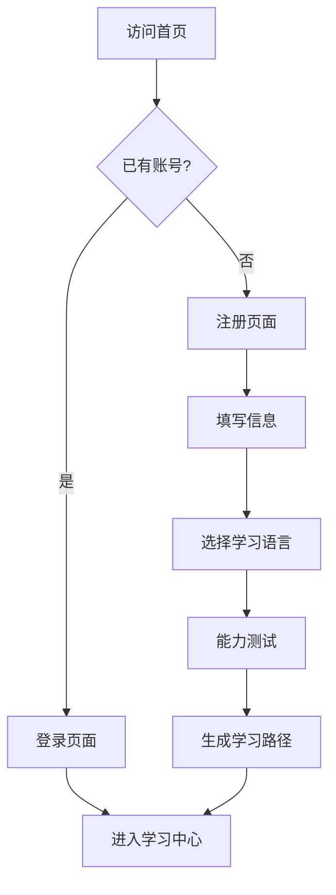
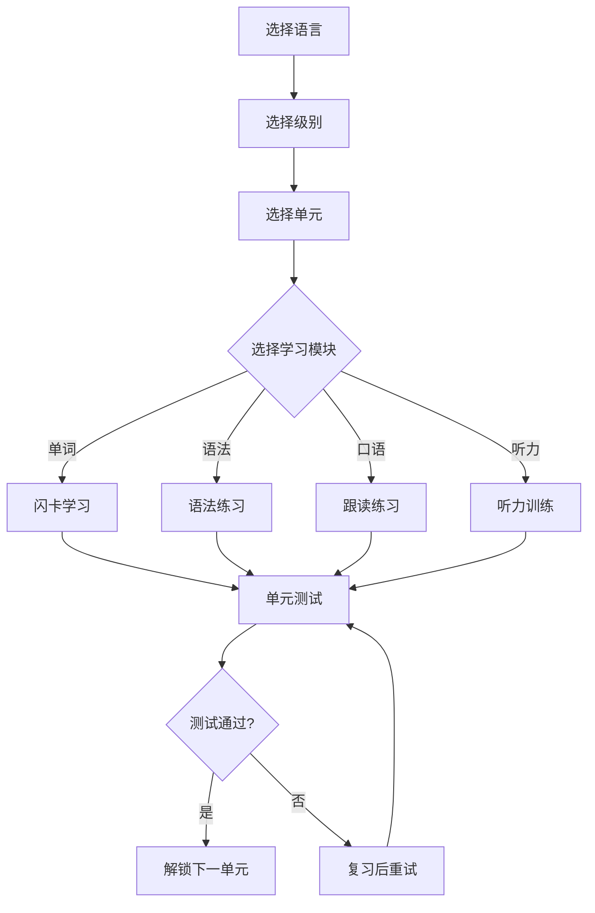

# 多语种在线教育平台 - 产品需求文档

## 1. 产品概述

LinguaFlow是一款沉浸式多语种在线学习平台,支持英语、日语、韩语等主流语言的学习。平台通过分级课程体系、互动式学习模块和成就激励系统,为用户打造轻松有趣的语言学习体验。

**核心价值:**
- 沉浸式学习体验,将语言学习与文化探索相结合
- 科学的分级体系,从零基础到精通的完整路径
- 游戏化学习机制,保持用户学习动力
- 个性化学习路径,根据用户情况智能推荐

## 2. 核心功能

### 2.1 用户角色
| 角色 | 注册方式 | 核心权限 |
|------|---------|---------|
| 访客 | 无 | 浏览首页、课程简介 |
| 注册用户 | 邮箱/手机注册 | 完整学习功能、社区互动、成就系统 |

### 2.2 功能模块

#### 2.2.1 分级课程体系
- **语言选择**: 英语(EN)、日语(JP)、韩语(KR)
- **级别划分**:
  - 入门级(A1/CEFR): 基础词汇、日常用语
  - 初级(A2/CEFR): 简单对话、基础语法
  - 中级(B1/CEFR): 流利对话、阅读理解
  - 中高级(B2/CEFR): 专业话题、文化深入
  - 高级(C1/CEFR): 复杂文本、精准表达
- **课程内容**: 每个级别包含多个单元,每单元包含词汇、语法、听力、口语四大模块

#### 2.2.2 互动式学习模块

**单词记忆模块:**
- 闪卡记忆法: 显示单词-隐藏-回忆循环
- 例句展示: 单词在真实语境中的应用
- 发音朗读: 真人发音示范
- 智能复习: 根据记忆曲线安排复习

**语法练习模块:**
- 互动例句: 高亮语法结构
- 即时反馈: 回答正确/错误提示
- 详细解析: 语法规则说明
- 练习题库: 选择题、填空题、排序题

**口语跟读模块:**
- 跟读练习: 模仿标准发音
- 录音对比: 播放原音与用户录音
- 智能评分:  pronunciation评分系统
- 场景对话: 模拟真实交流场景

**听力训练模块:**
- 逐句听写: 听力填空练习
- 速度调节: 0.75x, 1x, 1.25x播放速度
- 循环播放: 难点反复练习
- 听读结合: 听力文本同步显示

#### 2.2.3 学习进度追踪
- **个人仪表盘**: 今日学习时长、连续学习天数、本周学习目标
- **进度可视化**: 课程完成百分比、技能雷达图
- **数据分析**: 学习热力图、错误类型统计
- **历史回顾**: 学习记录、错题本

#### 2.2.4 用户注册登录
- **注册方式**: 邮箱注册、手机号注册
- **登录方式**: 邮箱/手机+密码登录
- **用户资料**: 头像、昵称、学习目标、偏好语言
- **安全设置**: 密码修改、邮箱绑定

#### 2.2.5 个性化学习路径推荐
- **能力评估**: 入学测试确定起始级别
- **智能推荐**: 基于学习数据推荐下一课程
- **学习计划**: 每日学习目标、周计划
- **薄弱点强化**: 针对错误率高的知识点重点练习

#### 2.2.6 社区交流及成就激励系统

**社区交流:**
- 学习小组: 按语言/级别组建学习群
- 话题讨论: 发起学习相关话题
- 笔记分享: 发布学习心得
- 学习伙伴: 结识同水平学习者

**成就激励:**
- **学习成就**: 连续学习7天/30天、首次完成课程、学习达人
- **技能徽章**: 词汇大师、语法达人、口语达人、听力高手
- **等级称号**: 语言探险家、文化使者、语言大师
- **排行榜**: 周学习时长排名、积分排名

## 3. 核心流程

### 3.1 用户注册登录流程


### 3.2 学习流程


## 4. 用户界面设计

### 4.1 设计风格
- **整体风格**: 现代简约、温暖友好、沉浸式体验
- **色彩方案**:
  - 主色: #6366F1 (靛蓝紫 - 智慧与创造力)
  - 次要色: #10B981 (翡翠绿 - 成长与进步)
  - 强调色: #F59E0B (琥珀金 - 成就与激励)
  - 背景色: #F8FAFC (雪白) / #1E293B (深色模式)
  - 文字色: #1E293B (主文字) / #64748B (次要文字)
- **圆角风格**: 中等圆角(8px-16px),友好亲切
- **阴影效果**: 柔和投影,增加层次感
- **图标风格**: 线性图标,简洁现代
- **字体选择**:
  - 标题: "Noto Sans SC", sans-serif
  - 正文: "Inter", "Noto Sans SC", sans-serif

### 4.2 页面设计概览

#### 首页 (Home)
| 模块 | 设计要点 |
|------|---------|
| 导航栏 | Logo、课程、学习中心、社区、我的、登录/注册按钮 |
| Hero区域 | 大标题、学习语言选择卡片(英语/日语/韩语)、开始学习按钮 |
| 特色展示 | 四个学习模块图标卡片、动态插图 |
| 学习统计 | 模拟学习数据展示、激励新用户 |
| 页脚 | 版权信息、社交媒体链接 |

#### 学习中心 (Dashboard)
| 模块 | 设计要点 |
|------|---------|
| 侧边栏 | 导航菜单、学习进度总览 |
| 今日任务 | 今日学习目标卡片、进度条 |
| 继续学习 | 最近课程快捷入口 |
| 学习统计 | 连续天数、本周时长、积分 |
| 课程列表 | 语言分类、级别选择、进度显示 |

#### 单词学习页 (Vocabulary)
| 模块 | 设计要点 |
|------|---------|
| 学习区域 | 单词卡片、正反面翻转动画、发音按钮 |
| 进度指示 | 当前进度/总进度、学习阶段标识 |
| 操作按钮 | 认识/模糊/不认识、学习模式切换 |
| 底部导航 | 模块切换: 词汇/语法/口语/听力 |

#### 口语练习页 (Speaking)
| 模块 | 设计要点 |
|------|---------|
| 对话场景 | 模拟情景图片、角色头像 |
| 音频波形 | 实时音频可视化 |
| 录音控制 | 开始/停止录音、播放原音/我的录音 |
| 评分显示 | 发音评分星级、改进建议 |
| 句子展示 | 待跟读句子、关键词高亮 |

#### 成就中心 (Achievements)
| 模块 | 设计要点 |
|------|---------|
| 成就徽章墙 | 网格展示、所有徽章(已获得/未获得) |
| 当前等级 | 等级进度条、下一等级要求 |
| 排行榜入口 | 周排名、月排名、好友排名 |
| 积分商城 | 虚拟奖励兑换 |

#### 社区页 (Community)
| 模块 | 设计要点 |
|------|---------|
| 话题分类 | 按语言/话题筛选标签 |
| 帖子列表 | 卡片式展示、点赞/评论数、作者信息 |
| 发布入口 | 发布新话题按钮 |
| 学习小组 | 推荐学习群、快速加入 |

### 4.3 响应式设计
- **桌面优先**: 1200px以上为完整布局
- **平板适配**: 768px-1199px 双栏布局,侧边栏可收起
- **移动端**: 320px-767px 单栏布局,底部导航栏

### 4.4 动效设计
- **页面切换**: 淡入淡出,300ms ease-out
- **卡片交互**: 悬停上浮、阴影加深
- **进度更新**: 数值动画、环形进度条填充
- **成就解锁**: 徽章飞入、闪光特效
- **学习反馈**: 正确-绿色脉冲、错误-红色震动

## 5. 技术架构

### 5.1 技术栈选择
- **前端框架**: React 18 + Vite
- **样式方案**: Tailwind CSS
- **路由管理**: React Router v6
- **状态管理**: React Context + useReducer
- **数据模拟**: Mock数据(模拟真实API响应)
- **图标库**: Lucide React
- **字体**: Google Fonts (Noto Sans SC, Inter)

### 5.2 项目结构
```
/workspace
├── index.html
├── package.json
├── vite.config.js
├── tailwind.config.js
├── postcss.config.js
├── src/
│   ├── main.jsx
│   ├── App.jsx
│   ├── index.css
│   ├── components/
│   │   ├── layout/
│   │   │   ├── Navbar.jsx
│   │   │   ├── Sidebar.jsx
│   │   │   └── Footer.jsx
│   │   ├── common/
│   │   │   ├── Button.jsx
│   │   │   ├── Card.jsx
│   │   │   ├── ProgressBar.jsx
│   │   │   └── Modal.jsx
│   │   └── learning/
│   │       ├── FlashCard.jsx
│   │       ├── AudioRecorder.jsx
│   │       └── QuizQuestion.jsx
│   ├── pages/
│   │   ├── Home.jsx
│   │   ├── Login.jsx
│   │   ├── Register.jsx
│   │   ├── Dashboard.jsx
│   │   ├── Vocabulary.jsx
│   │   ├── Grammar.jsx
│   │   ├── Speaking.jsx
│   │   ├── Listening.jsx
│   │   ├── Achievements.jsx
│   │   └── Community.jsx
│   ├── context/
│   │   ├── AuthContext.jsx
│   │   └── LearningContext.jsx
│   ├── data/
│   │   ├── courses.js
│   │   ├── vocabulary.js
│   │   └── achievements.js
│   └── utils/
│       └── helpers.js
└── .gitignore
```

### 5.3 路由定义
| 路由 | 页面 | 功能说明 |
|------|------|---------|
| / | Home | 首页、语言选择、开始学习入口 |
| /login | Login | 用户登录页面 |
| /register | Register | 用户注册页面 |
| /dashboard | Dashboard | 学习中心、个人进度总览 |
| /learn/:language/:level | Learning | 学习模块入口 |
| /vocabulary/:courseId | Vocabulary | 单词记忆学习 |
| /grammar/:courseId | Grammar | 语法练习 |
| /speaking/:courseId | Speaking | 口语跟读练习 |
| /listening/:courseId | Listening | 听力训练 |
| /achievements | Achievements | 成就中心、徽章墙 |
| /community | Community | 社区交流、话题讨论 |
| /profile | Profile | 个人资料设置 |

### 5.4 数据模型

#### 用户数据 (User)
```javascript
{
  id: string,
  email: string,
  username: string,
  avatar: string,
  nativeLanguage: string,
  learningLanguages: string[],
  currentLevel: {
    [language]: string // e.g., { en: 'A1', jp: 'beginner', kr: 'A2' }
  },
  stats: {
    totalXP: number,
    streakDays: number,
    totalMinutes: number,
    wordsLearned: number
  },
  achievements: string[],
  joinDate: string
}
```

#### 课程数据 (Course)
```javascript
{
  id: string,
  language: string, // 'en' | 'jp' | 'kr'
  level: string, // 'A1' | 'A2' | 'B1' | 'B2' | 'C1' | 'C2'
  title: string,
  description: string,
  units: [
    {
      id: string,
      title: string,
      lessons: number,
      vocabulary: number,
      grammar: number,
      speaking: number,
      listening: number
    }
  ],
  requiredXP: number
}
```

#### 学习记录 (Progress)
```javascript
{
  userId: string,
  courseId: string,
  completedLessons: string[],
  quizResults: {
    [lessonId]: {
      score: number,
      attempts: number,
      lastAttempt: string
    }
  },
  lastAccessed: string,
  completionRate: number
}
```

## 6. 页面清单

1. **首页 (Home)** - 语言选择入口、平台介绍、开始学习
2. **登录页 (Login)** - 邮箱/手机登录、表单验证
3. **注册页 (Register)** - 用户注册、能力测试入口
4. **学习中心 (Dashboard)** - 进度总览、课程列表、快速入口
5. **单词学习页 (Vocabulary)** - 闪卡学习、发音、进度追踪
6. **语法练习页 (Grammar)** - 语法讲解、例句、练习题
7. **口语练习页 (Speaking)** - 跟读录音、评分反馈
8. **听力训练页 (Listening)** - 听力材料、听写练习
9. **成就中心 (Achievements)** - 徽章墙、排行榜、积分
10. **社区页 (Community)** - 话题讨论、学习小组
11. **个人资料 (Profile)** - 用户信息、设置
